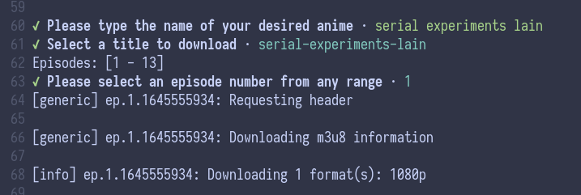

AnimeGo-DL
=======================
<!-- ALL-CONTRIBUTORS-BADGE:START - Do not remove or modify this section -->
[](#contributors-)

<!-- ALL-CONTRIBUTORS-BADGE:END -->

<div class="d-flex flex-items-center justify-flex-between">
  <div>
    
  </div>

  <div>
    <p style="text-align: justify;">
      &nbsp; A blazingly fast :rocket:  node-based cli tool that streams (or downloads) anime from gogoanimes!
    </p>
  </div>
</div>

---


<br />

**Table of Contents**:
* [Dependencies](#dependencies)
* [Installation](#installation)
* [Usage](#usage)
  - [Streaming](#streaming)
  - [Downloading](#downloading)
* [Contributing](#contributing)
* [Development](#development)
  - [Testing](#testing)
* [Disclaimer](#disclaimer)

## Dependencies

> :warning: Sorry Windows users, things have been tested on Linux & MacOS only.  Support
> might be coming soon.

First, make sure you have the following installed on your machine:
* [yt-dlp](https://github.com/yt-dlp/yt-dlp) - a youtube download fork with additional fixes and features.
* nodejs - the latest LTS should be good

## Installation

Install from [NPM](https://www.npmjs.com/package/animego-dl) - *recommended*:
```sh
npm install -g animego-dl # remove with: npm uninstall -g animego-dl
```

\- *or* -


Install with Docker:
* Pull the [latest](https://hub.docker.com/r/vinnya3/animego-dl) docker image: `docker pull vinnya3/animego-dl`
* Please refer to [Usage](#docker) for running w/ Docker.

\- *or* -

Install from source:
1. Clone repo: `git clone https://github.com/vinnyA3/animego-dl.git`
2. Change into the project directory: `cd animego-dl`
3. Install script dependencies: `npm install`
4. Compile Typescript source: `npm run build`
5. *optional* - install command globally:
    * `npm install -g .`
    * to uninstall: `npm uninstall -g animego-dl`

## Usage

```sh
Usage: animego-dl [options]

CLI tool to download your favorite anime series.

Options:
  -v, --version   output the current version
  -d, --download  choose to download your desired anime
  -h, --help      display help for command
```

**note**: if you installed the package globally, you can simply run:

```sh
animego-dl
```

If you did not install globally & installed from source (but do not want to link to your machine), you can run the following from the root of the project (after running `npm run build` - to compile from typescript):
```
node ./dist/bin
```

### Streaming

To stream, just run the tool (`animego-dl`) and you're good to go!  You will
prompted to search for you desired anime, then will be presented a range(s) of
episode numbers to select from.  Using the CLI, input the episode number you
wish to watch.

> :notebook: The tool will try to spin up [MPV](https://www.google.com/url?sa=t&rct=j&q=&esrc=s&source=web&cd=&cad=rja&uact=8&ved=2ahUKEwjU26PJnb34AhXAIzQIHbX9BqsQFnoECAkQAQ&url=https%3A%2F%2Fmpv.io%2F&usg=AOvVaw1b8_yCiS5ge8PPghViO-l-) by default.  If MPV isn't
> detected, you'll receive the video source in the output -- you can use this
> source, and plug into a stream client of your choice (more default player
> support coming soon!)

### Downloading

To download an anime episode, pass the `-d` option when starting the tool:
```bash
animego-dl -d
```

Next, search & select the episode you'd like to download via the cli.  Enjoy!

> :warning: The tool will download to your current working directory (where you
> ran the command), and under a directory named `animego-dl` -- options to
> choose your destination directory will be added soon!

---

## Docker

First, make sure you installed the [Docker image](https://hub.docker.com/r/vinnya3/animego-dl).

Next, create your desired mount directory -- this will be your machine's local
directory, where the anime will be downloaded; for example: `mkdir ./anime`

You can now start create the mount point & run the container:
```
docker run --rm -v ${PWD}/anime:/anime -it animego-dl /bin/bash
```

After running the aforementioned command, you will be directed to an interactive
shell session.  From here, you can run the tool as instructed [here](#usage).

:warning: **important note**: make sure the download directory, specified by the
`-d` option is `/anime` -- this is the mount point specified inside of the
container.  The actual download directory, on your host machine, is what you
specified earlier (when running the container).

Example(s):
```
#app> animego-dl -d /anime 'monster'
```

## Contributing

All contributions are welcome!  Please refer the [contributing document](CONTRIBUTING.md) for
project practices and the Code of Conduct.

Also, checkout the [list of the project's contributors](#contributors-)!

## Development

The project is built with [Typescript](https://www.typescriptlang.org/).  To
compile the source into working JavaScript, you can run:
```bash
npm run build
```

The aforementioned will compile to `/dist`.  For here, you can execute the
program with:
```bash
node ./dist/bin
```

## Testing

To run local tests: `npm run test`

To run tests in watch mode: `npm run test:watch`

> :warning: Tests are few and far between at the moment.  In fact, no test
> suites are live at this time - 2/13/22.

## Disclaimer

This project, and it's owner, does not endorse piracy!  Anime streaming services are
:100:% supported!

`animego-dl` uses anime information & sources that is fully available to the public.

## Contributors ✨

Thanks goes to these wonderful people ([emoji key](https://allcontributors.org/docs/en/emoji-key)):

<!-- ALL-CONTRIBUTORS-LIST:START - Do not remove or modify this section -->
<!-- prettier-ignore-start -->
<!-- markdownlint-disable -->
<table>
  <tr>
    <td align="center"><a href="https://github.com/mayanknoldus"><br /><sub><b>mayanknoldus</b></sub></a><br /><a href="https://github.com/vinnyA3/animego-dl/commits?author=mayanknoldus" title="Code">💻</a></td>
  </tr>
</table>

<!-- markdownlint-restore -->
<!-- prettier-ignore-end -->

<!-- ALL-CONTRIBUTORS-LIST:END -->

This project follows the [all-contributors](https://github.com/all-contributors/all-contributors) specification. Contributions of any kind welcome!
